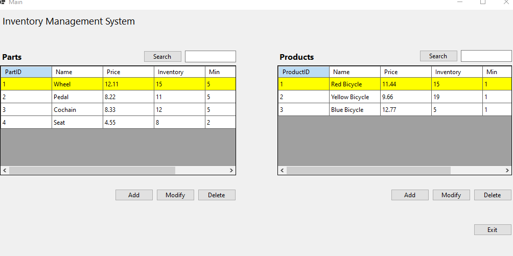

## Inventory Management System

## Description

This project is an inventory management system that allows the user to add, remove, and update products and parts. The user can also search for products and parts by ID or name. The user can also add and remove parts from products.

## Technologies

- C#
- .NET Framework
- Windows Forms

---

